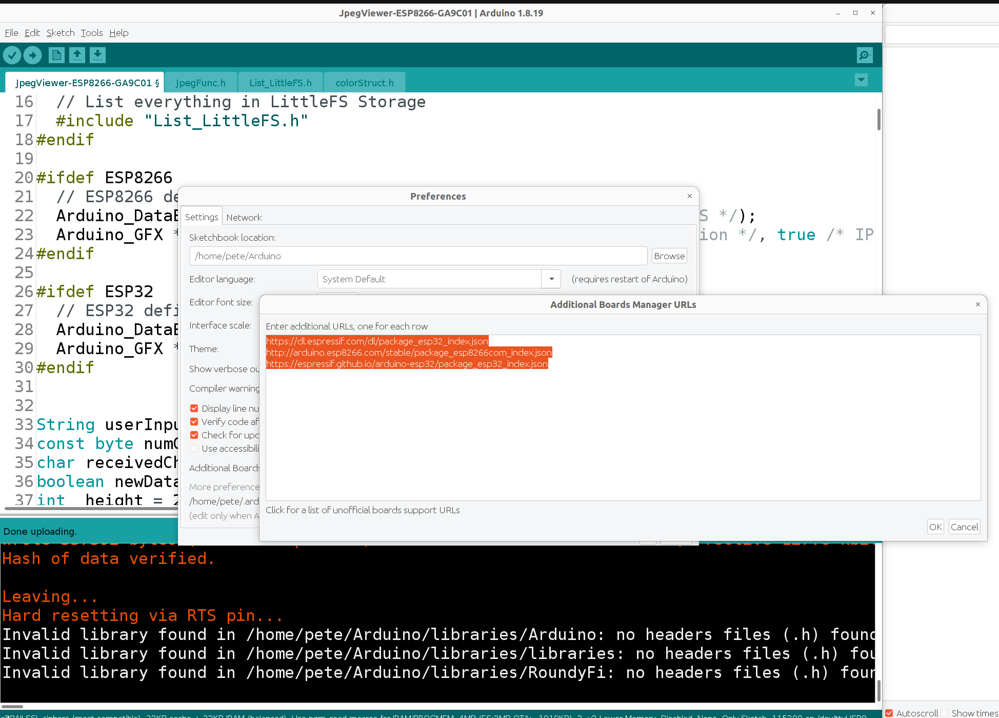
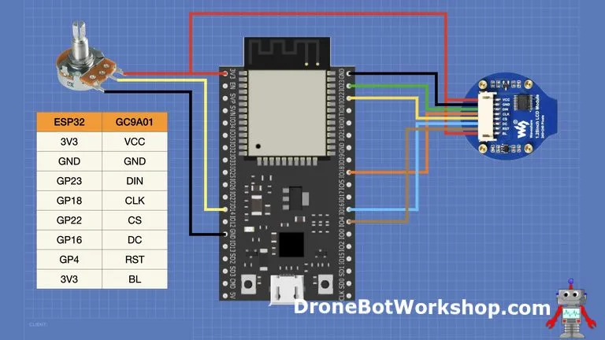
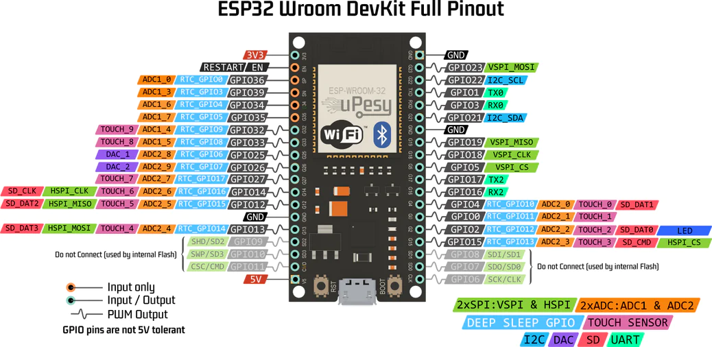

# JpegViewer-ESP8266-gc9a01

_Inspiration_
I was heavily inspired by the "K1 Devil Burner" after seeing a video on YouTube. The package was deemed too expensive so I grabbed a cheap LCD round display named, RoundyFi. $(21) After breaking the RoundyFi I bought a 3-pack of some cheaper $(24) LCD displays and started hooking them up to ESP8826 and ESP32.
https://www.google.com/search?q=k1+devil+burner&oq=k1+devil+burner&gs_lcrp=EgZjaHJvbWUyBggAEEUYOdIBCDQ5NDVqMGo3qAIAsAIA&sourceid=chrome&ie=UTF-8#fpstate=ive&vld=cid:69d335a3,vid:E5RaALcMHHg,st:0

_Face Specs_

- Eyes are 44 x 40 px

_Setup_
This is the original tutorial I used to setup my ESP8266 NodeMCU Amica v1.0
https://thesolaruniverse.wordpress.com/2022/11/01/an-internet-synced-clock-circular-display-with-gc9a01-controller-powered-by-an-esp8266/

The display is driven by the GC9A01 controller. (I swapped them in the original title)

These are the pins I used for the ESP8266 / ESP 32

| SCREEN | ESP8266 | ESP32 |     |
| ------ | ------- | ----- | --- |
| RST    | D4      | 4     | RST |
| CS     | D8      | 22    | CS  |
| DC     | D2      | 16    | DC  |
| SDA    | D7      | 23    | DIN |
| SCL    | D5      | 18    | CLK |
| GND    | GND     | GND   | GND |
| VCC    | 3V      | 3V    | 3V  |

### ADD these to Arduino.

- Preferences -> Additional Board Managers
- `https://dl.espressif.com/dl/package_esp32_index.json`
  `http://arduino.esp8266.com/stable/package_esp8266com_index.json`
  `https://espressif.github.io/arduino-esp32/package_esp32_index.json`

### Useful Diagrams

## Screen Specs

- https://www.amazon.com/Teyleten-Robot-Display-Interface-240x240/dp/B0B7TFRNN1
- 1.VCC:Power
- 2.GND:Power Ground
- 3.SCL:This pin is used to be serial interface clock
- 4.SDA:SPl interface input/output pin.the data is latched on the rising edge of the SCL signal.
- 5.DC:Display data/command selection pin in 4-line serial interface
- 6.CS:Chip selection pin;Low enable, high disable
- 7.RST:This signal will reset the device and it must be applied to properly initialize the chip.Signal is active low.

ESP8266
Install LittleFS uploader

ESP32
Install SPIFFS uploader
https://randomnerdtutorials.com/install-esp32-filesystem-uploader-arduino-ide/

Install zips to ~/Arduino/tools

_Running commands over Serial_
Commands must be wrapped in <brackets>
EXAMPLES:
_Dynamic text_
Dynamic text MUST begin with asterisk*
`<*Howdy friend|0|110|3|3|1>`Print 'Howdy friend' on screen at x:0,y:110,size:3,color:3:wipe screen:1(true)`<*%75|20|140|3|3|0>` Print '75%' on screen at x:20,y:140,size:3,color:3:wipe screen:0(false)
*Static routines\*
`<0>` popEye
`<1>` Fangs
`<2>` grumpyFace
`<3>` winkFace
`<4>` disappointedFace
`<5>` satisfiedFace
`<6>` normalFace
`<7>`
`<8>`
`<9>`
`<10>`
`<11>`
`<12>`
`<13>`
`<14>`
`<15>`
`<16>`
`<17>`
`<18>`
`<19>`
`<20>` circleWipe no screen wipe
`<21>` circleWipe yes screen wipe
`<22>` triangleWipe no screen wipe
`<23>` triangleWipe yes screen wipe
`<24>`
`<25>`
`<26>`
`<27>`
`<28>`
`<29>`
`<30>` drawRimCircle
`<31>` Draw text by regions N,S,E,W, center
`<32>`
`<33>`
`<34>`
`<35>`
`<36>`
`<37>`
`<38>`
`<39>`
`<40>`
`<41>`
`<42>`
`<43>`
`<44>`
`<45>`
`<46>`
`<47>`
`<48>`
`<49>`
`<50>` octocat
`<51>` calvinAndHobbes
`<52>`
`<53>`
`<54>`
`<55>`
`<56>`
`<57>`
`<58>`
`<59>`
`<60>`
`<61>`
`<62>`
`<63>`
`<64>`
`<65>`
`<66>`
`<67>`
`<68>`
`<69>`
`default` calvinDuplicator
